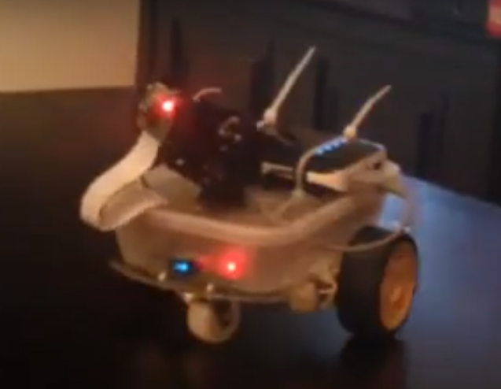

# RPi Robot #



## Requirements ##

Use the following hardware configure using this .

### Hardware ###

* Video camera
* Ultrasonic sensor
* 2 x Servos
* 2 x Motors + Controller + Chasis
* Speed sensor
* Microswitches (tbi)

### Software ###

* Python 3.6
* Python packages in requirements.txt.
* pigpio - see https://github.com/joan2937/pigpio/ and http://abyz.co.uk/rpi/pigpio/download.html
* bluez - to access Bluetooth GPS sensor. Device needs to be paired.

### Configuration ###

* Build robot according to specification.
* Create virtualenv with python 3.6 (uses async).
* Install python packages in requirements.txt file.
* In /etc/rc.local add:
```bash
chown root.gpio /dev/gpiomem
chmod g+rw /dev/gpiomem
pigpiod

rfcomm bind /dev/rfcomm0 <bluetooth mac address> 1
```
### Running ###

* Activate virtualenv
* Go to cloned code folder
* python -m robot.robot_server

### Developing ###

* On robot, python -m robot.rpc_server
* Use your IDE and debug robot.robot_server
